# Arizona Lavka Marketplace

Fullstack marketplace/BFF-сервис для Arizona RP / Arizona Market: React-приложение для просмотра лавок и генерации торговых конфигов поверх FastAPI backend, PostgreSQL, Redis и внешнего API marketplace.

Проект включает backend API, frontend SPA, Docker Compose-инфраструктуру, безопасную конфигурацию секретов, Prometheus/Grafana-мониторинг и документацию по эксплуатации.

<p align="center">
  
  
  
  
  
  
</p>

<p align="center">
  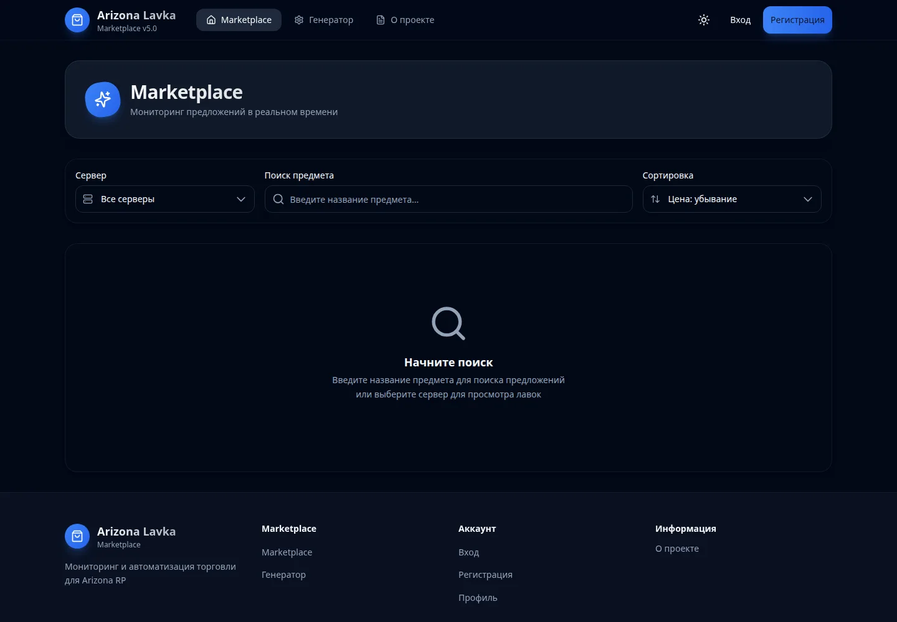
</p>

## Содержание

- [Быстрая демонстрация](#быстрая-демонстрация)
- [Интерфейс](#интерфейс)
- [Что показывает демо](#что-показывает-демо)
- [О проекте](#о-проекте)
- [Возможности](#возможности)
- [Технологический стек](#технологический-стек)
- [Архитектура](#архитектура)
- [Быстрый старт](#быстрый-старт)
- [Локальная разработка](#локальная-разработка)
- [Конфигурация](#конфигурация)
- [API](#api)
- [Frontend-приложение](#frontend-приложение)
- [Безопасность](#безопасность)
- [Мониторинг и метрики](#мониторинг-и-метрики)
- [Эксплуатационные команды](#эксплуатационные-команды)
- [Troubleshooting](#troubleshooting)
- [Полезные документы](#полезные-документы)
- [Roadmap](#roadmap)
- [Лицензия и статус](#лицензия-и-статус)

## Быстрая демонстрация

Короткий сценарий показывает публичную часть сервиса: открытие marketplace, выбор сервера, поиск, переход к генератору конфигов и просмотр OpenAPI-спецификации.

<p align="center">
  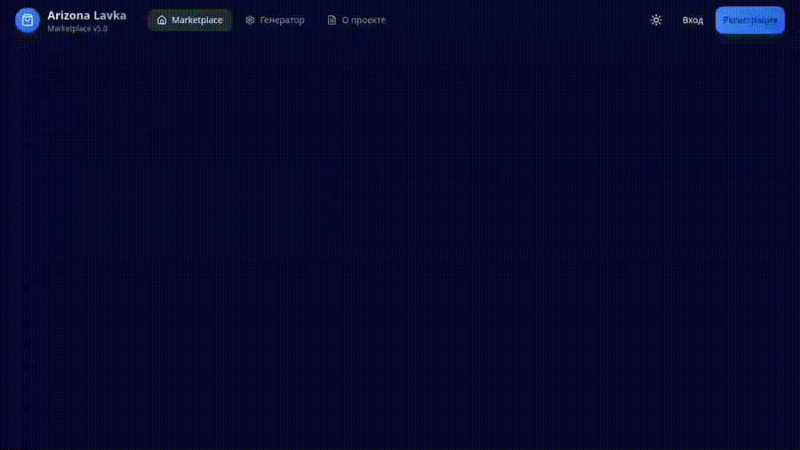
</p>

<p align="center">
  <a href="docs/assets/readme/video/arizona-lavka-demo.mp4">
    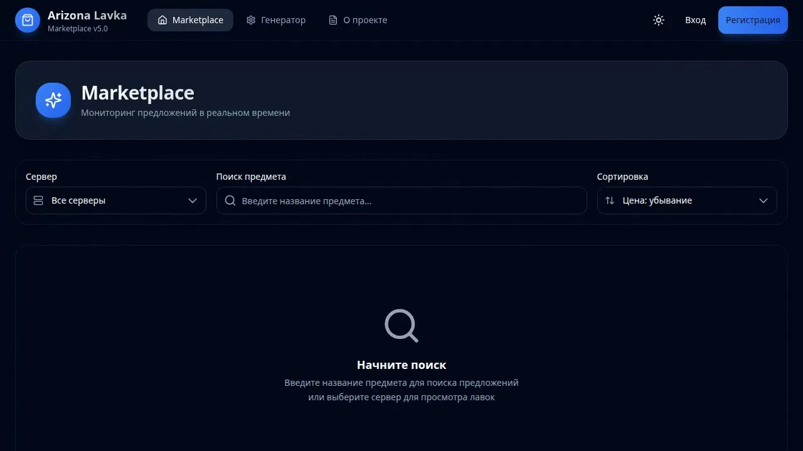
  </a>
</p>

<p align="center">
  <a href="docs/assets/readme/video/arizona-lavka-demo.mp4">Смотреть MP4-демо</a>
</p>

## Интерфейс

Все изображения ниже сняты с реально запущенного локального Docker Compose stack. В момент съёмки внешний marketplace API не вернул активных лавок для выбранного сервера, поэтому marketplace-экраны честно показывают runtime empty-state, а не подставленные вручную товары.

| Экран | Что видно |
| --- | --- |
| 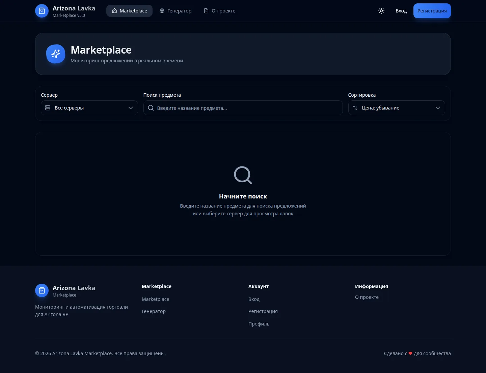 | Главная marketplace-страница: навигация, фильтр сервера, поиск предмета, сортировка и empty-state до выбора фильтров. |
| 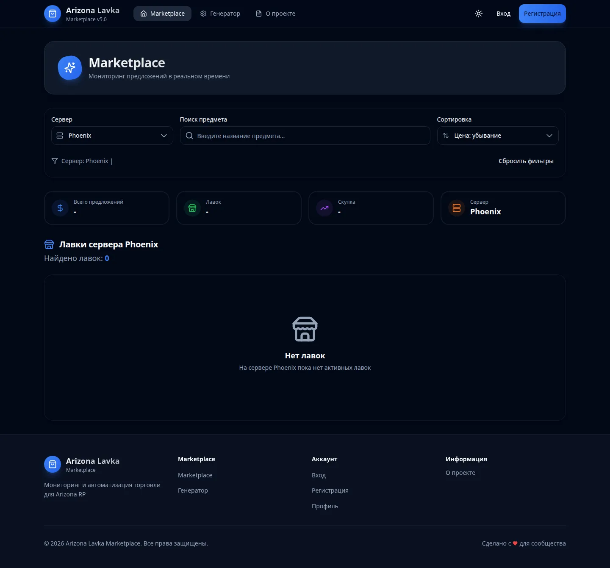 | Marketplace после выбора сервера Phoenix: статистические блоки, активный фильтр и реальный ответ без активных лавок. |
|  | Поиск предмета и активные фильтры в React UI. |
| 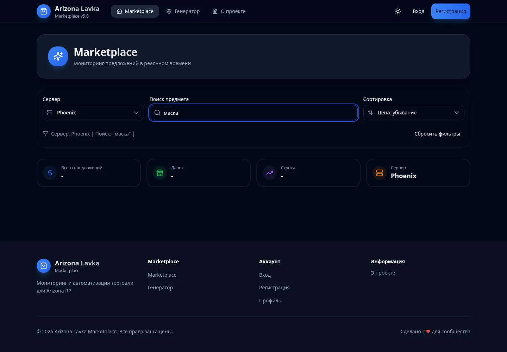 | Итоговый state marketplace-сценария после применения фильтров и поиска. |
| 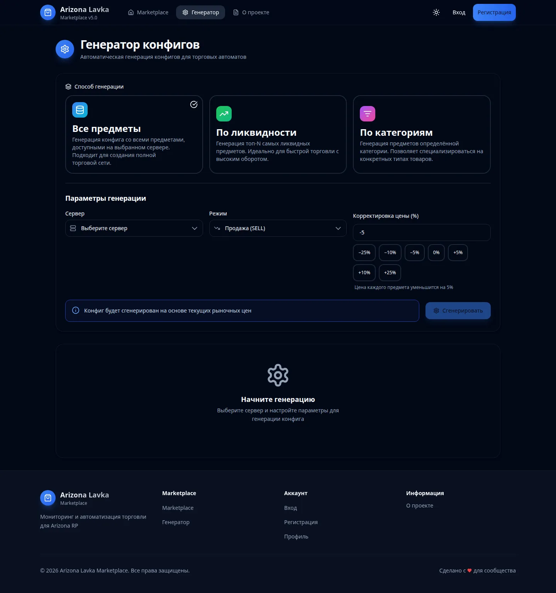 | Генератор конфигов: способы генерации, выбор сервера, режим SELL/BUY и корректировка цены. |
| 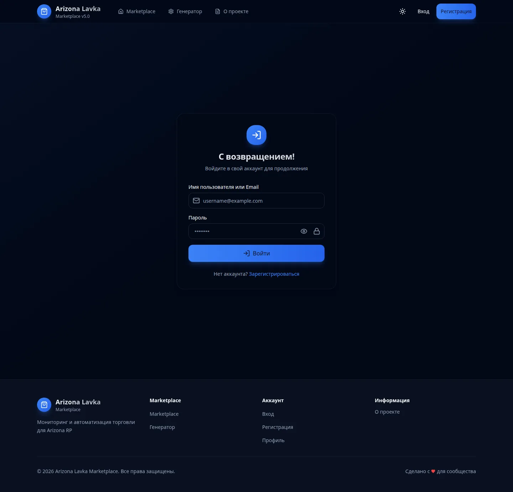 | Экран входа без реальных credentials; видны только placeholder-поля. |
| 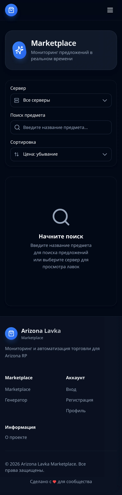 | Мобильная адаптация marketplace-экрана. |

## Что показывает демо

1. Пользователь открывает React frontend на `http://localhost:8080`.
2. Frontend обращается к FastAPI backend через `/api`.
3. Marketplace UI позволяет выбрать сервер, выполнить поиск и увидеть фактическое состояние данных.
4. Генератор конфигов показывает параметры будущей генерации без раскрытия секретов и без тестовых credentials.
5. Backend предоставляет OpenAPI JSON, health endpoints и Prometheus metrics endpoint.

## О проекте

`Arizona Lavka Marketplace` агрегирует данные Arizona Market, нормализует предложения лавок и отдаёт frontend-ориентированный API для поиска, просмотра, генерации конфигов и административной аналитики.

Backend работает как BFF: принимает запросы от SPA, обращается к внешнему marketplace API, использует PostgreSQL для пользовательских данных и истории, Redis/in-memory cache для ускорения ответов, а также отдаёт Prometheus-метрики.

Frontend реализован как SPA на React/TypeScript: пользовательские страницы, авторизация, профиль, список лавок, генератор конфигов, админ-панель, режим обслуживания и клиентские метрики.

## Возможности

- Просмотр серверов Arizona RP и marketplace-данных.
- Поиск предложений покупки/продажи с фильтрацией по серверу, цене и предмету.
- Просмотр лавок и состава конкретной лавки.
- Регистрация, вход, refresh/logout, Telegram WebApp-аутентификация.
- Email verification, Cloudflare Turnstile и антиспам-проверки при регистрации.
- Избранные предметы и price alerts для пользователя.
- Генерация торговых конфигов по marketplace-данным, истории и категориям.
- Админ-панель: пользователи, логи, audit logs, настройки, maintenance mode, агрегированные метрики.
- Prometheus metrics endpoint и отдельный monitoring stack с Grafana.
- Docker Compose-запуск для локальной разработки и secure-вариант с Docker secrets.

## Технологический стек

### Backend

| Область | Технологии |
| --- | --- |
| Runtime | Python 3.12 |
| Web API | FastAPI 0.109, Uvicorn |
| DB | PostgreSQL 17, SQLAlchemy 2 async, asyncpg |
| Миграции | Alembic |
| Валидация | Pydantic 2, pydantic-settings |
| Auth | JWT, python-jose, PyJWT, bcrypt |
| HTTP client | httpx |
| Cache | Redis 7, cachetools TTLCache, application cache |
| Background jobs | APScheduler |
| Observability | prometheus-client, custom middleware |
| Code quality | black, isort, flake8, mypy, pytest |

### Frontend

| Область | Технологии |
| --- | --- |
| Framework | React 19 |
| Language | TypeScript 5.7 |
| Build | Vite 6 |
| Styling | Tailwind CSS |
| Routing | React Router |
| Server state | TanStack Query |
| Local state | Zustand |
| HTTP | Axios |
| Forms | React Hook Form, Zod |
| UI/UX | Lucide React, Framer Motion, Sonner |
| Tables/charts | TanStack Table, TanStack Virtual, Recharts |
| Bot protection | `@marsidev/react-turnstile` |
| Tests | Vitest, Playwright scripts in `package.json` |

### Infrastructure

| Область | Решение |
| --- | --- |
| Контейнеризация | Docker Compose |
| Frontend runtime | Nginx Alpine |
| Backend image | Python 3.12 slim |
| Database | PostgreSQL 17 Alpine |
| Cache/session backend | Redis 7 Alpine |
| Monitoring | Prometheus, Grafana, Node Exporter, Postgres Exporter |
| Secrets | Docker secret files, env vars, локальный secrets manager |

### Security

| Механизм | Где реализован |
| --- | --- |
| JWT validation и expiry | `backend/config.py`, `backend/services/auth_service.py` |
| Turnstile verification | `backend/services/turnstile_service.py` |
| Rate limiting | `backend/interfaces/http/middleware/rate_limit_middleware.py` |
| Security headers | `backend/interfaces/http/middleware/security_middleware.py` |
| Anti-spam и disposable email checks | `backend/services/security_service.py`, `backend/utils/email_validator.py` |
| Device fingerprinting | `backend/services/security_service.py` |
| Audit/admin logs | `backend/services/audit_log_service.py`, `backend/routes/admin.py` |
| Secrets loading | `backend/utils/secrets_manager.py`, `backend/config.py` |

### Observability

| Компонент | Назначение |
| --- | --- |
| `/metrics` | Prometheus text format от backend |
| `metrics.middleware` | HTTP duration, counters, in-progress requests |
| `backend/routes/metrics.py` | Сбор пользовательских событий, сессий, pageviews, conversions |
| `backend/routes/admin_metrics.py` | Административная аналитика и export |
| `monitoring/prometheus.yml` | Prometheus scrape targets |
| `monitoring/grafana/...` | Provisioning и dashboard для Grafana |

## Архитектура

### Общая схема

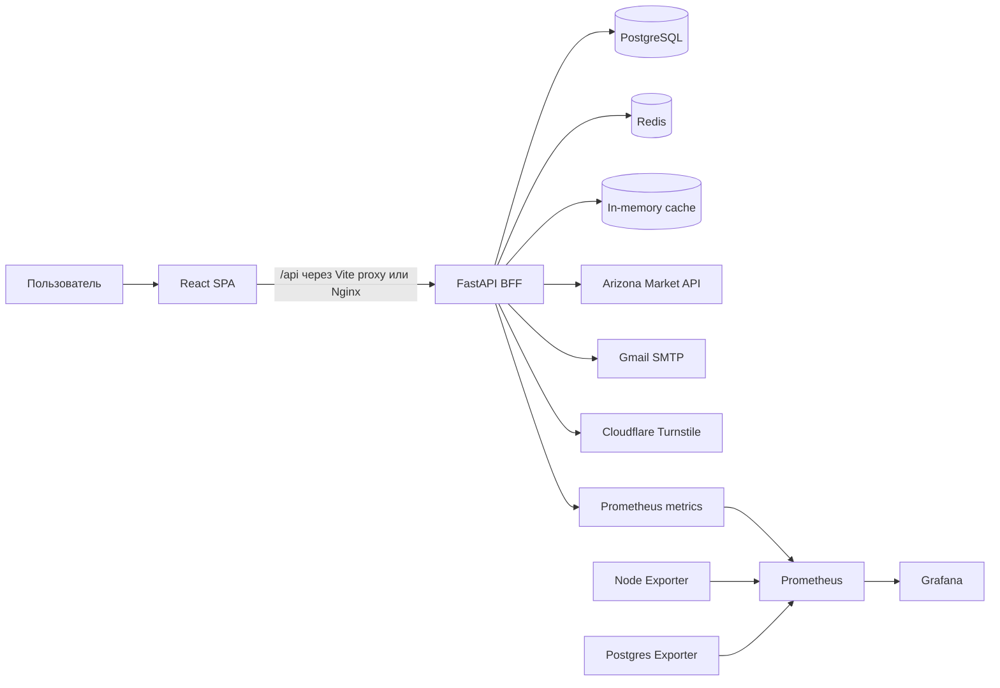

### Поток запроса marketplace

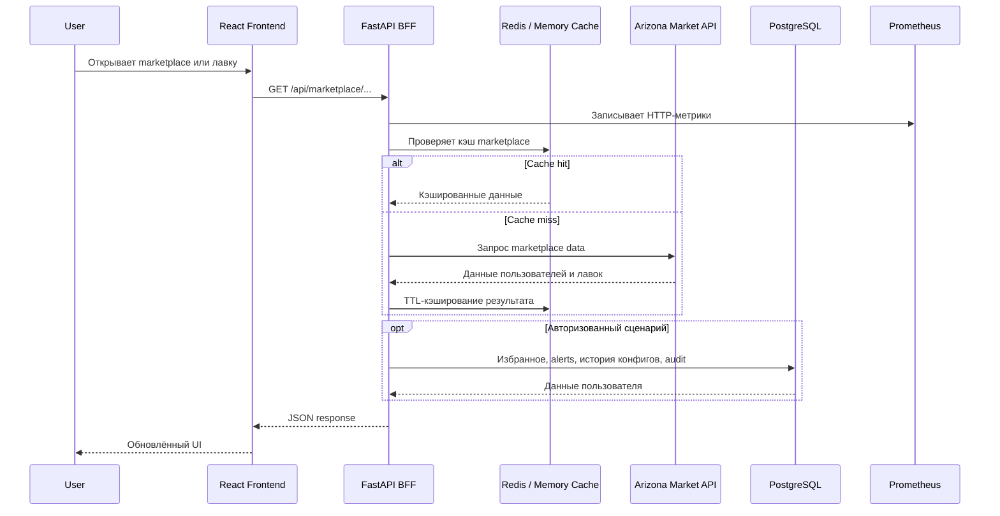

### Backend-слои

| Слой | Назначение |
| --- | --- |
| `core/` | Доменные сущности, enum и базовые исключения |
| `application/` | Application services, DTO, интерфейсы repositories/UoW/external |
| `infrastructure/` | PostgreSQL models/repositories/UoW, Redis, cache, external marketplace API |
| `interfaces/http/` | HTTP middleware: logging, maintenance, rate limiting, security |
| `routes/` | FastAPI endpoint-группы |
| `services/` | Бизнес-сервисы, auth, config generator, marketplace, security, metrics |
| `metrics/` | Prometheus registry, middleware и exporter router |

### Структура репозитория

```text
.
├── README.md
├── api_spec.json
├── docker-compose.yml
├── docker-compose.secure.yml
├── docker-compose.monitoring.yml
├── generate_secrets.py
├── validate_security.py
├── SECURITY_SETUP.md
├── CACHING_ARCHITECTURE.md
├── monitoring/
│   ├── README.md
│   ├── prometheus.yml
│   └── grafana/
├── backend/
│   ├── main.py
│   ├── config.py
│   ├── pyproject.toml
│   ├── requirements.txt
│   ├── alembic/
│   ├── application/
│   ├── core/
│   ├── infrastructure/
│   ├── interfaces/
│   ├── metrics/
│   ├── routes/
│   └── services/
└── frontend/
    ├── package.json
    ├── vite.config.ts
    ├── tailwind.config.js
    ├── nginx.conf
    └── src/
```

## Быстрый старт

### Требования

- Docker и Docker Compose plugin.
- Python 3.12 для локального backend-запуска и генерации секретов.
- Node.js 22+ для локального frontend-запуска.
- Свободные локальные порты: `8000`, `8080`, `7432`, `6380`.

### Клонирование

```bash
git clone https://github.com/GloryWater/arizona-lavka.git
cd arizona-lavka
```

### Настройка окружения

Для локального ознакомления можно проверить основной compose:

```bash
docker compose config --quiet
```

Для режима с Docker secret files сначала сгенерируйте безопасные значения:

```bash
python generate_secrets.py
```

Скрипт создаёт файлы в `secrets/`. Для production замените mock/локальные значения на реальные ключи Turnstile, SMTP credentials и устойчивые секреты.

### Безопасный пример переменных

Не храните реальные значения в README, issue, commit message или публичных логах.

```env
POSTGRES_USER=arizonalavka
POSTGRES_PASSWORD=<POSTGRES_PASSWORD>
POSTGRES_DB=arizonalavka
POSTGRES_HOST=postgres
POSTGRES_PORT=5432

JWT_SECRET_KEY=<JWT_SECRET_KEY>
CLOUDFLARE_TURNSTILE_SITE_KEY=<SECRET_VALUE>
CLOUDFLARE_TURNSTILE_SECRET_KEY=<TURNSTILE_SECRET_KEY>
GMAIL_USERNAME=<SECRET_VALUE>
GMAIL_APP_PASSWORD=<SMTP_PASSWORD>

FRONTEND_URL=http://localhost:8080
CORS_ORIGINS=http://localhost:8080,http://localhost:3000,http://localhost:5173
EXTERNAL_API_URL=https://api.arz.market/api/getSelectedMarketplace/-1
REDIS_URL=redis://redis:6379/0
```

### Запуск через Docker Compose

Обычный локальный режим:

```bash
docker compose up -d --build
```

Secure-режим с secret files:

```bash
python generate_secrets.py
python validate_security.py
docker compose -f docker-compose.secure.yml up -d --build
```

### Проверка запуска

```bash
docker compose ps
curl -fsS http://localhost:8000/health
curl -fsS http://localhost:8000/api/health
curl -fsS http://localhost:8080/
```

После запуска доступны:

| Компонент | URL |
| --- | --- |
| Frontend | `http://localhost:8080` |
| Backend API | `http://localhost:8000` |
| Backend health | `http://localhost:8000/health` |
| API health | `http://localhost:8000/api/health` |
| Swagger UI | `http://localhost:8000/docs` |
| ReDoc | `http://localhost:8000/redoc` |
| OpenAPI JSON | `http://localhost:8000/openapi.json` |

Если всё запущено корректно, frontend должен выглядеть как на скриншотах в разделах [Быстрая демонстрация](#быстрая-демонстрация) и [Интерфейс](#интерфейс).

### Остановка

```bash
docker compose down
```

Для secure-режима:

```bash
docker compose -f docker-compose.secure.yml down
```

## Локальная разработка

### Backend

```bash
cd backend
python -m venv .venv
source .venv/bin/activate
pip install -r requirements.txt
uvicorn main:app --reload --host 0.0.0.0 --port 8000
```

Backend ожидает PostgreSQL и может использовать Redis. Проще всего поднять инфраструктуру через Docker Compose и запускать приложение локально поверх тех же сервисов.

### Frontend

```bash
cd frontend
npm ci
npm run dev
```

Vite dev server настроен на порт `3000`. Proxy в `frontend/vite.config.ts` отправляет `/api` на `http://localhost:8000`.

Полезные команды:

```bash
npm run build
npm run preview
npm run lint
npm run test:unit
npm run test:e2e
```

В `package.json` есть скрипты Vitest и Playwright. В текущем дереве репозитория тестовые файлы не обнаружены, поэтому перед использованием тестового набора проверьте наличие тестов и конфигов в вашей ветке.

### База данных и миграции

Alembic находится в `backend/alembic`.

```bash
cd backend
alembic upgrade head
```

Не вставляйте реальные DSN в документацию или логи. Для подключения используйте переменные окружения или secret files.

### Кэш Redis

Redis используется для кэширования и сессионных сценариев. Application cache поддерживает Redis backend и fallback в in-memory cache, если Redis недоступен и включён `CACHE_FALLBACK_TO_MEMORY`.

Основные настройки:

- `REDIS_URL`
- `REDIS_CACHE_TTL_SECONDS`
- `CACHE_BACKEND`
- `CACHE_TTL_SECONDS`
- `CACHE_MAX_SIZE`
- `CACHE_PREFIX`

### Линтинг и проверки backend

```bash
cd backend
black . --check
isort . --check-only
flake8 .
mypy .
pytest
```

Зависимости для этих команд есть в `backend/requirements.txt` и `backend/pyproject.toml`.

## Конфигурация

### Основные переменные окружения

| Переменная | Назначение | Пример безопасного значения |
| --- | --- | --- |
| `POSTGRES_USER` | Пользователь PostgreSQL | `arizonalavka` |
| `POSTGRES_PASSWORD` | Пароль PostgreSQL | `<POSTGRES_PASSWORD>` |
| `POSTGRES_DB` | Имя БД | `arizonalavka` |
| `POSTGRES_HOST` | Host БД внутри Docker network | `postgres` |
| `POSTGRES_PORT` | Port БД внутри Docker network | `5432` |
| `JWT_SECRET_KEY` | Секрет подписи JWT | `<JWT_SECRET_KEY>` |
| `PRODUCTION` | Production-режим | `true` / `false` |
| `DEBUG` | Debug/reload режим | `false` |
| `CORS_ORIGINS` | Разрешённые origins | `http://localhost:8080,http://localhost:3000` |
| `EXTERNAL_API_URL` | Внешний Arizona Market endpoint | `https://api.arz.market/api/getSelectedMarketplace/-1` |
| `API_TIMEOUT_SECONDS` | Timeout внешнего API | `30` |
| `RATE_LIMIT_PER_MINUTE` | Лимит запросов middleware | `120` |
| `REDIS_URL` | Redis connection URL | `redis://redis:6379/0` |
| `CACHE_TTL_SECONDS` | TTL application cache | `300` |
| `CACHE_MAX_SIZE` | Размер in-memory cache | `1000` |
| `CLOUDFLARE_TURNSTILE_SITE_KEY` | Public key для frontend | `<SECRET_VALUE>` |
| `CLOUDFLARE_TURNSTILE_SECRET_KEY` | Secret key для backend verification | `<TURNSTILE_SECRET_KEY>` |
| `GMAIL_USERNAME` | SMTP username | `<SECRET_VALUE>` |
| `GMAIL_APP_PASSWORD` | SMTP app password | `<SMTP_PASSWORD>` |
| `FRONTEND_URL` | URL frontend для email links | `http://localhost:8080` |
| `VITE_API_URL` | Base URL frontend API client | `/api` |
| `VITE_APP_NAME` | Название приложения | `Arizona Lavka Marketplace` |
| `VITE_APP_VERSION` | Версия frontend | `5.0.0` |

### Порты

| Сервис | Порт на localhost | Порт в контейнере | Назначение |
| --- | ---: | ---: | --- |
| Frontend Docker | `8080` | `80` | React SPA через Nginx |
| Backend | `8000` | `8000` | FastAPI API |
| PostgreSQL | `7432` | `5432` | База данных |
| Redis | `6380` | `6379` | Cache/session backend |
| Vite dev server | `3000` | `3000` | Локальная frontend-разработка |
| Prometheus | `9090` | `9090` | Метрики |
| Grafana | `3000` | `3000` | Dashboard UI |
| Node Exporter | `9100` | `9100` | Метрики хоста |
| Postgres Exporter | `9187` | `9187` | Метрики PostgreSQL |

`3000` используется и Vite dev server, и Grafana. Не запускайте их одновременно на одном host-порту без перенастройки.

### Docker services

| Service | Compose-файл | Назначение |
| --- | --- | --- |
| `postgres` | `docker-compose.yml`, `docker-compose.secure.yml` | PostgreSQL 17 |
| `backend` | `docker-compose.yml`, `docker-compose.secure.yml` | FastAPI BFF |
| `redis` | `docker-compose.yml`, `docker-compose.secure.yml` | Redis cache/session backend |
| `frontend` | `docker-compose.yml`, `docker-compose.secure.yml` | Nginx + Vite build |
| `prometheus` | `docker-compose.monitoring.yml` | Сбор метрик |
| `grafana` | `docker-compose.monitoring.yml` | Дашборды |
| `node-exporter` | `docker-compose.monitoring.yml` | Метрики host-системы |
| `postgres-exporter` | `docker-compose.monitoring.yml` | Метрики PostgreSQL |

## API

### OpenAPI / Swagger

После запуска backend:

- Swagger UI: `http://localhost:8000/docs`
- ReDoc: `http://localhost:8000/redoc`
- OpenAPI JSON: `http://localhost:8000/openapi.json`
- Зафиксированная спецификация в репозитории: `api_spec.json`

<p align="center">
  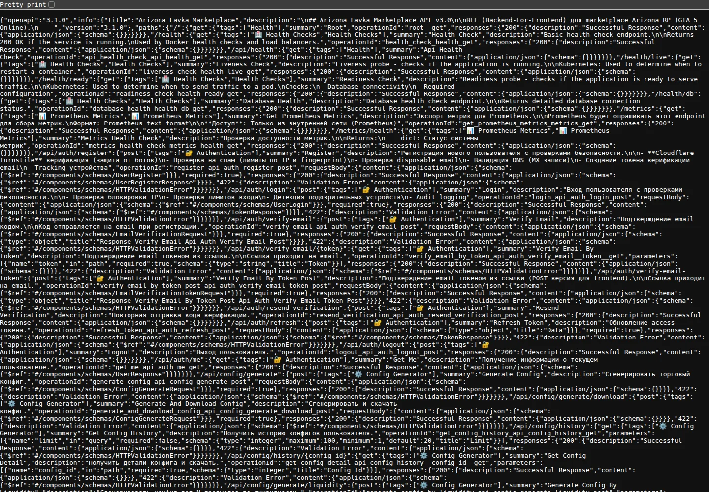
</p>

> Swagger UI доступен по `/docs`, но в текущей secure-настройке backend CSP блокирует внешние Swagger UI CDN assets. Поэтому визуальная демонстрация показывает локальный `/openapi.json`, который генерируется тем же FastAPI-приложением.

### Основные группы endpoints

| Группа | Endpoint prefix | Назначение |
| --- | --- | --- |
| Root/Health | `/`, `/health`, `/api/health`, `/health/live`, `/health/ready`, `/health/db` | Проверка доступности приложения и БД |
| Marketplace | `/api/marketplace` | Серверы, items mapping, предложения, поиск, лавки |
| Auth | `/api/auth` | Регистрация, вход, refresh/logout, текущий пользователь, email verification |
| Telegram Auth | `/telegram` | Telegram WebApp login и текущий пользователь |
| Config Generator | `/api/config` | Генерация и скачивание торговых конфигов, история, категории, настройки |
| User | `/api/user` | Профиль, избранное, price alerts |
| User Management | `/api/users` | Дополнительные сценарии регистрации/переноса данных |
| Admin | `/api/v1/admin` | Пользователи, export, логи, audit, настройки, maintenance mode |
| Admin Metrics | `/api/v1/admin/metrics` | Overview, engagement, conversions, users, export |
| Client Metrics | `/api/metrics` | Сессии, pageviews, события, conversions |
| Prometheus | `/metrics`, `/metrics/health` | Export метрик для Prometheus |

### Безопасные примеры запросов

```bash
curl -fsS http://localhost:8000/health
curl -fsS http://localhost:8000/api/health
curl -fsS http://localhost:8000/api/marketplace/servers
curl -fsS http://localhost:8000/metrics | head
```

<p align="center">
  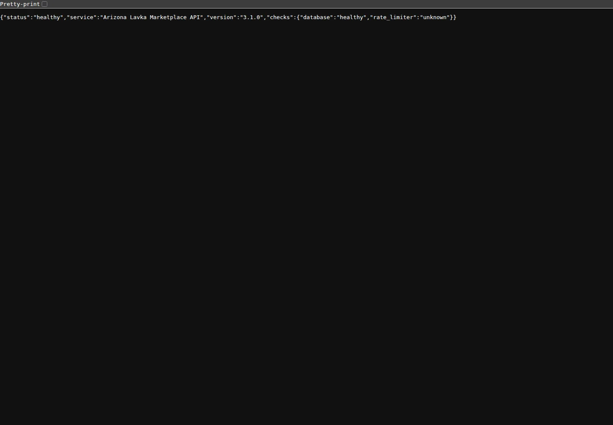
</p>

Примеры для авторизованных endpoints должны использовать только безопасный placeholder:

```bash
curl -fsS http://localhost:8000/api/auth/me \
  -H "Authorization: Bearer <SECRET_VALUE>"
```

Не публикуйте реальные access/refresh tokens.

## Frontend-приложение

Frontend находится в `frontend/src` и организован вокруг страниц, feature-модулей, shared API-клиента и виджетов layout/header/footer.

Ключевые маршруты SPA:

| Route | Назначение |
| --- | --- |
| `/` | Главная страница |
| `/lavka/:lavkaUid` | Детальная страница лавки |
| `/config-generator` | Генератор торговых конфигов |
| `/login` | Вход |
| `/register` | Регистрация |
| `/verify` | Подтверждение email |
| `/profile` | Профиль пользователя |
| `/about` | О проекте |
| `/maintenance` | Режим обслуживания |
| `/admin` | Админ dashboard |
| `/admin/users` | Пользователи |
| `/admin/logs` | Логи |
| `/admin/settings` | Настройки |

API client в `frontend/src/shared/api/client.ts` использует:

- `VITE_API_URL` или fallback `/api`;
- Axios interceptors;
- автоматическую подстановку `Authorization: Bearer ...`;
- refresh token flow для `401`;
- redirect на `/maintenance` при maintenance response.

В Docker frontend собирается в static assets и обслуживается Nginx. `frontend/nginx.conf` содержит SPA fallback и proxy `/api` на backend.

## Безопасность

Секреты не должны храниться в README, публичных issue, логах или commit message. Для документации используйте только placeholders:

- `<POSTGRES_PASSWORD>`
- `<JWT_SECRET_KEY>`
- `<SMTP_PASSWORD>`
- `<TURNSTILE_SECRET_KEY>`
- `<SECRET_VALUE>`

### Генерация и проверка секретов

```bash
python generate_secrets.py
python validate_security.py
```

`generate_secrets.py` создаёт файлы в `secrets/`. Для production замените mock Turnstile keys и SMTP credentials на реальные значения. `JWT_SECRET_KEY` должен быть устойчивым и иметь достаточную длину; в production backend не должен стартовать без корректного JWT-секрета.

### Secure Compose

`docker-compose.secure.yml` использует Docker secret files:

```bash
docker compose -f docker-compose.secure.yml config --quiet
docker compose -f docker-compose.secure.yml up -d --build
```

Файлы, связанные с безопасной настройкой:

- `SECURITY_SETUP.md`
- `generate_secrets.py`
- `validate_security.py`
- `docker-compose.secure.yml`
- `backend/config.py`
- `backend/utils/secrets_manager.py`
- `backend/interfaces/http/middleware/security_middleware.py`

### Реализованные меры

- JWT access/refresh tokens.
- Cloudflare Turnstile verification.
- Email verification.
- Rate limiting middleware.
- Security headers middleware.
- Disposable email и DNS checks.
- Anti-spam limits по IP/fingerprint.
- Device fingerprint tracking.
- Audit logs и admin logs.
- Maintenance mode middleware.
- Secrets loading из secure manager, Docker secret files или environment.

## Мониторинг и метрики

Backend отдаёт Prometheus metrics endpoint:

```bash
curl -fsS http://localhost:8000/metrics | head
```

Monitoring stack находится в `docker-compose.monitoring.yml` и `monitoring/`.

Важно: `docker-compose.monitoring.yml` не является полностью самостоятельным compose-файлом, потому что `postgres-exporter` зависит от сервиса `postgres`. Запускайте мониторинг вместе с основным или secure compose:

```bash
docker compose -f docker-compose.yml -f docker-compose.monitoring.yml up -d --build
```

или:

```bash
docker compose -f docker-compose.secure.yml -f docker-compose.monitoring.yml up -d --build
```

Проверка конфигурации:

```bash
docker compose -f docker-compose.yml -f docker-compose.monitoring.yml config --quiet
docker compose -f docker-compose.secure.yml -f docker-compose.monitoring.yml config --quiet
```

Доступные UI:

| UI | URL | Примечание |
| --- | --- | --- |
| Prometheus | `http://localhost:9090` | Targets и PromQL |
| Grafana | `http://localhost:3000` | Dev credentials из compose нужно заменить перед production |
| Backend metrics | `http://localhost:8000/metrics` | Prometheus text format |

<p align="center">
  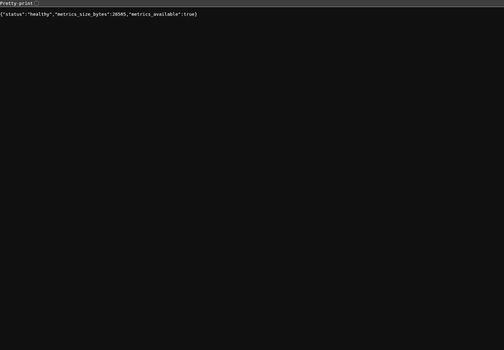
</p>

> В этом прогоне Prometheus UI не поднялся из-за сетевого сбоя при pull monitoring images, поэтому скриншот показывает реальный backend metrics health endpoint. Команды запуска Prometheus/Grafana остаются приведены выше.

Примеры метрик описаны в `monitoring/README.md`: HTTP requests, auth, marketplace, config generator, security, external API, cache/circuit breaker.

## Эксплуатационные команды

### Compose

```bash
docker compose config --quiet
docker compose up -d --build
docker compose ps
docker compose logs -f backend
docker compose logs -f frontend
docker compose logs --tail=100 backend
docker compose down
```

### Secure Compose

```bash
python generate_secrets.py
python validate_security.py
docker compose -f docker-compose.secure.yml config --quiet
docker compose -f docker-compose.secure.yml up -d --build
docker compose -f docker-compose.secure.yml ps
docker compose -f docker-compose.secure.yml logs -f backend
docker compose -f docker-compose.secure.yml down
```

### Monitoring

```bash
docker compose -f docker-compose.yml -f docker-compose.monitoring.yml up -d --build
docker compose -f docker-compose.yml -f docker-compose.monitoring.yml ps
docker compose -f docker-compose.yml -f docker-compose.monitoring.yml logs -f prometheus
docker compose -f docker-compose.yml -f docker-compose.monitoring.yml down
```

### Health checks

```bash
curl -fsS http://localhost:8000/health
curl -fsS http://localhost:8000/health/live
curl -fsS http://localhost:8000/health/ready
curl -fsS http://localhost:8000/health/db
curl -fsS http://localhost:8080/health
```

## Обновление скриншотов README

Визуальные материалы README лежат в `docs/assets/readme`. Скрипт `scripts/capture-readme-assets.mjs` открывает реально запущенные frontend/backend endpoints через Playwright и пересоздаёт screenshots, GIF, MP4 и thumbnail.

```bash
docker compose up -d --build
cd frontend
npm ci
cd ..
node scripts/capture-readme-assets.mjs
docker compose down
```

Для monitoring-скриншота можно дополнительно поднять overlay:

```bash
docker compose -f docker-compose.yml -f docker-compose.monitoring.yml up -d --build
node scripts/capture-readme-assets.mjs
docker compose -f docker-compose.yml -f docker-compose.monitoring.yml down
```

## Troubleshooting

| Симптом | Что проверить |
| --- | --- |
| Backend не стартует в production | Задан ли `JWT_SECRET_KEY` или `JWT_SECRET_KEY_FILE`; длина секрета не меньше требований backend |
| `docker-compose.monitoring.yml` падает отдельно | Запускайте его вместе с `docker-compose.yml` или `docker-compose.secure.yml`, потому что нужен сервис `postgres` |
| Frontend не видит API | Проверьте `VITE_API_URL`, Nginx `/api` proxy и доступность `http://localhost:8000/api/health` |
| Vite и Grafana конфликтуют | Оба используют host-порт `3000`; остановите один сервис или измените порт |
| PostgreSQL недоступен | Проверьте `docker compose ps postgres`, порт `7432`, healthcheck и переменные `POSTGRES_*` |
| Redis недоступен | Проверьте `docker compose ps redis`; backend может перейти на memory fallback при соответствующей настройке |
| Регистрация не проходит | Проверьте Turnstile keys, SMTP settings, disposable email/DNS checks и rate limit |
| Email verification не отправляется | Проверьте `GMAIL_USERNAME`, `GMAIL_APP_PASSWORD`, `FRONTEND_URL`, логи backend |
| Swagger открывается, но endpoints возвращают 503 | Проверьте БД, внешнее marketplace API, maintenance mode и логи backend |
| Prometheus targets down | Проверьте `http://localhost:8000/metrics`, Docker network `arizonalavka_default`, `monitoring/prometheus.yml` |

## Полезные документы

| Документ | Назначение |
| --- | --- |
| `SECURITY_SETUP.md` | Безопасная настройка и управление секретами |
| `CACHING_ARCHITECTURE.md` | Архитектура Redis/in-memory cache |
| `monitoring/README.md` | Prometheus/Grafana stack, метрики и PromQL |
| `api_spec.json` | OpenAPI specification snapshot |
| `FINAL_IMPLEMENTATION_REPORT.md` | Итоговый отчёт по реализации |
| `CLEANUP_REPORT.md` | Отчёт по cleanup-работам |
| `rules.md` | Инструкции по внешней nginx/SSL-настройке |
| `backend/backend_structure.md` | Описание backend-структуры, если актуально для ветки |

## Roadmap

Возможные улучшения, которые логично развивать дальше:

- Убрать чувствительные значения из небезопасных compose/config-файлов и оставить только secret/env placeholders.
- Добавить `.env.example` без реальных секретов.
- Зафиксировать backend/frontend test suites и включить их в CI.
- Добавить production-ready Grafana credentials/secrets вместо dev defaults.
- Добавить alerting rules для Prometheus.
- Синхронизировать `api_spec.json` с текущим runtime OpenAPI в рамках release-процесса.

## Лицензия и статус

Проект помечен в backend metadata как proprietary/commercial. Перед публикацией, передачей или production-развёртыванием проверьте юридический статус лицензии, секреты, домены, SMTP-настройки и права на использование внешнего API.
